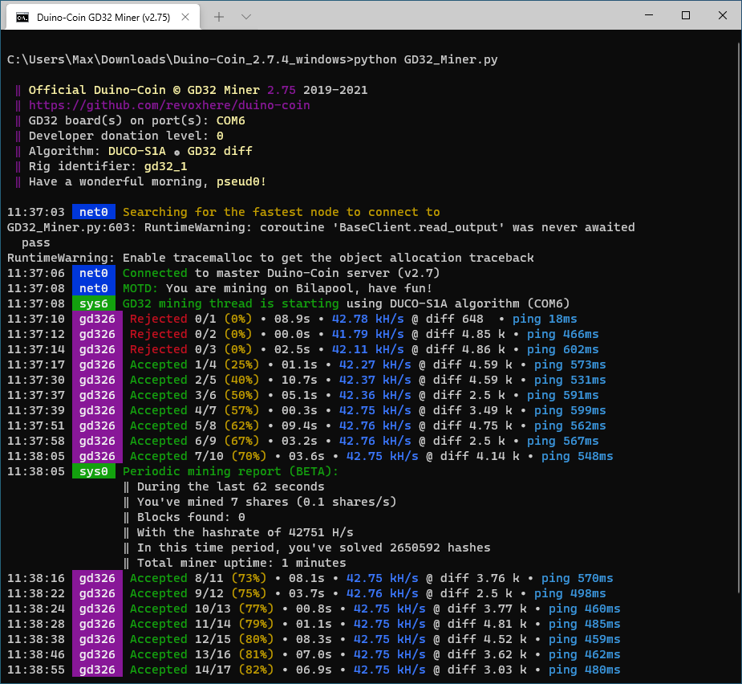

# GD32 Duino-Coin Miner

## Description

Contains the firmware and miner software for mining [DUCO (Duino-Coin)](https://github.com/revoxhere/duino-coin) on GigaDevice GD32 chips. 

## Supported boards

* [GD32E503C-START](https://www.aliexpress.com/item/1005003224840104.html) (GD32E503CET6, ARM Cortex-M33 @ 180 MHz)
* more GD32 boards to come and to be tested

## Compiling the firmware

Use the [PlatformIO](https://platformio.org/) build system to compile the firmware. You also see the steps at related projects like [here](https://github.com/CommunityGD32Cores/gd32-pio-projects#importing-examples).

## Performance

| Device        | Hashrate      | Profit (ᕲ/day)  |
| ------------- |:-------------:| -----:|
| GD32E503CE    | 42.9 kH/s     | ≈0.3 ᕲ/day |

## Mining

Start the `GD32_Miner.py` Python script with at least Python version 3. 

At the first run, you will be prompted for the DUCO wallet username to send coins to.  

Settings like the COM port on which the GD32 device is available will be auto-deteced at the first start and written into the `Duino-Coin GD32 Miner 2.75/Settings.cfg` file.

## Notes

It is normal to get the first few shares REJECTED as they're on a too low difficulty and the hash-rate too high. The Kolka balancing will kick in shortly.

Currently, the `GD32_Miner.py` reports the board type as ESP32 as the hash-rate is the closest to the [currently listed types](https://github.com/Bilaboz/duino-coin-pools/blob/main/config/poolRewards.json). This may be subject to change. Kolka balancing does currently not make this an issue, but it would still be ne nice to have its own category.